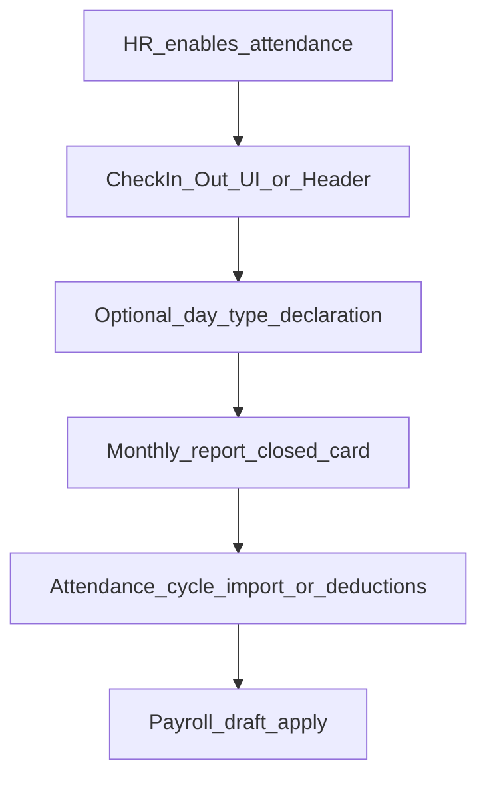

# تصميم الحضور المباشر بالورديات (النوع الثاني) — دراسة فقط

> الحالة: **دراسة وتصميم — لم يُنفَّذ بعد**  
> التاريخ: 2026-08-27  
> السياق: بعد اعتماد النوع الأول (رفع Excel/CSV + تقرير خصومات)

## الهدف

تمكين تسجيل حضور/انصراف مباشر داخل المنصة وفق وردية داخلية، مع دعم الموظف الميداني.

## نطاق النوع الأول (منفّذ)

1. رفع ملف Excel/CSV لحركات البصمة.
2. تقرير حضور شهري + تقرير خصومات ومبالغ.
3. اعتماد الدورة → تطبيق على مسودة المسير.

## نطاق النوع الثاني (مطلوب دراسته)

### 1. الورديات الداخلية

| العنصر | وصف مبدئي |
|---|---|
| تعريف وردية | اسم، وقت بداية، وقت نهاية، أيام الأسبوع، سماح التأخر |
| إسناد وردية | ربط موظف ↔ وردية (فترة سريان) |
| تسجيل مباشر | حضور/انصراف من «مساحتي» أو من شاشة HR |
| احتساب | التأخر والإضافي نسبةً لوردية الموظف لا لوقت مكتب ثابت |

### 2. الموظف الميداني

| العنصر | وصف مبدئي |
|---|---|
| علم ميداني | `employees_profile.is_field_worker` (موجود) |
| بداية ميدانية | موقع + إثبات (صورة/إحداثيات) — مسار أولي موجود |
| الاعتماد | المدير يعتمد قبل احتساب اليوم كحضور |
| بدون بصمة | لا يُطلب fingerprint_id للميداني |

### 3. تفعيل النوع

- إعداد على مستوى المنصة: `attendance.mode = import | shifts | hybrid`
- أو على مستوى الموظف: مصدر الحضور = استيراد / وردية / مختلط

## أسئلة مفتوحة قبل التنفيذ

1. هل الورديات متعددة لكل موظف في نفس اليوم؟
2. ما سياسة العمل عن بُعد داخل الوردية؟
3. هل الباركود جزء من الوردية أم قناة مستقلة؟
4. كيف يُدمج الميداني مع تقرير الخصم الشهري؟

## ملفات حالية ذات صلة

- `AttendanceService` — check-in/out، barcode، field، import
- `AttendanceDeductionService` — دورة وخصم
- `AttendanceCycleIndex` — واجهة النوع الأول الموحّدة
- `docs/plans/ATTENDANCE-BARCODE-DESIGN.md` — تصميم سابق للباركود

## دورة حياة الحضور من داخل المنصة فقط (تحديث Round 2)

> بدون أجهزة بصمة خارجية في هذه المرحلة — التسجيل من الواجهة / الهيدر / مساحتي.

| الخطوة | أين | ملاحظة |
|---|---|---|
| تفعيل البرنامج | الملف / شاشة الحضور (بطاقة مغلقة) | شرط للتسجيل |
| حضور/انصراف | شاشة الحضور + زر الهيدر | `AttendanceService` |
| إقرار نوع اليوم | بطاقة مطوية | لا يخصم آلياً |
| تقرير شهري | بطاقة مطوية افتراضياً | طباعة |
| خصم/استيراد | دورة الحضور | النوع الأول المنفّذ |
| ورديات داخلية | هذا المستند — لاحقاً | النوع الثاني |

## قرار التنفيذ

يُؤجَّل تنفيذ الورديات الكاملة حتى اعتماد أسئلة الورديات أعلاه. تحسينات واجهة Round 2 (بطاقات مغلقة + زر هيدر) منفّذة على مسار التسجيل الحالي.
